# Hi there, I'm Chianti 👋

## 🚀 About Me

I'm a passionate 20-year-old 🇫🇷 student who loves software development and hardware projects. I enjoy working with various technologies and exploring new tools to enhance my skills.
I'm currently in an apprenticeship at Subatech (CNRS/IN2P3) alongside my studies at the IUT in Nantes.

## 🛠️ Technologies and Tools

- Programming Languages: Java & Kotlin, Go, C++, Rust, HTML, JavaScript, and TypeScript (a bit).
- Tools and Software: JetBrains IDE Suite, Tmux with Oh My Zsh, and container technologies such as Docker & Podman.
- OSes: Arch Linux with KDE for my main machine, Fedora and AlmaLinux at work, and Windows 11 for playing games.

## 📊 Wakatime Stats

## 📊 GitHub Stats

## 🤝 Contact Me

- LinkedIn: [https://www.linkedin.com/in/chianti-gally](https://www.linkedin.com/in/chianti-gally)

Feel free to contact me!
